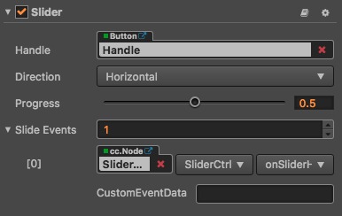

# Slider component reference

Slider is a slider component, For the production of UI components such as volume adjustment.




Click the 'Add component' slider at the bottom of the **Properties** panel and select 'Slider' from 'Add UI component'. You can then add the Slider component to the node.

Please refer to the script interface of the slider [Slider API](../api/classes/Slider.html)

## Slider property

| Property     | Function explanation |
| -------------- | ----------- |
| handle         | Slider button parts can be adjusted through the button to adjust the size of the Slider value |
| direction      | The direction of the slider is divided into horizontal and vertical |
| progress       | Current progress value, the value of the interval is between 0-1 |
| slideEvents    | Slider component event callback function |

## Slider event


| Attributes      | Function explanation |
| --------------  | ----------- |
| Target          | Node with script component |
| Component       | Script component name |
| Handler         | Specifies a callback function that will be called when the Slider event occurs |
| CustomEventData | The user specifies an arbitrary string as the last argument of the event callback |

Slider event callback has two parameters, the first parameter is the Slider itself, the second parameter is CustomEventData

## Detailed explanation

Slider is usually used to adjust the value of the UI (for example, volume adjustment), it is the main component of a slider button, which is used for user interaction, which can be adjusted by the size of the Slider.

Usually a Slider node tree as shown below:


#### Add a callback by script code

##### One method

This method adds the event callbacks and the event callbacks that are added to the editor using the same code,
You need to first construct a `cc.Component.EventHandler` object, and then set the corresponding target, component, handler and customEventData parameters.

```js
var sliderEventHandler = new cc.Component.EventHandler();
sliderEventHandler.target = this.node; // Is the node of your event handling code component
sliderEventHandler.component = "cc.MyComponent"
sliderEventHandler.handler = "callback";
sliderEventHandler.customEventData = "foobar";

slider.slideEvents.push(sliderEventHandler);

// here is your component file
cc.Class({
    name: 'cc.MyComponent'
    extends: cc.Component,

    properties: {
    },

    callback: function(slider, customEventData) {
        // Where slider is a cc.Slider object
        // Where the customEventData parameter is equal to the "foobar"
    }
});
```

##### Method two

By `slider.node.on('slide', ...)` way to add

```js
// Suppose we add event handling callbacks to the onLoad method of a component and perform event handling in the callback function:

cc.Class({
    extends: cc.Component,

	
    properties: {
       slider: cc.Slider
    },
    
    onLoad: function () {
       this.slider.node.on('slide', this.callback, this);
    },
    
    callback: function (event) {
       // Here event is a EventCustom object, you can get Slider components through event.detail
       var slider = event.detail;
       // do whatever you want with the slider
    }
});
```