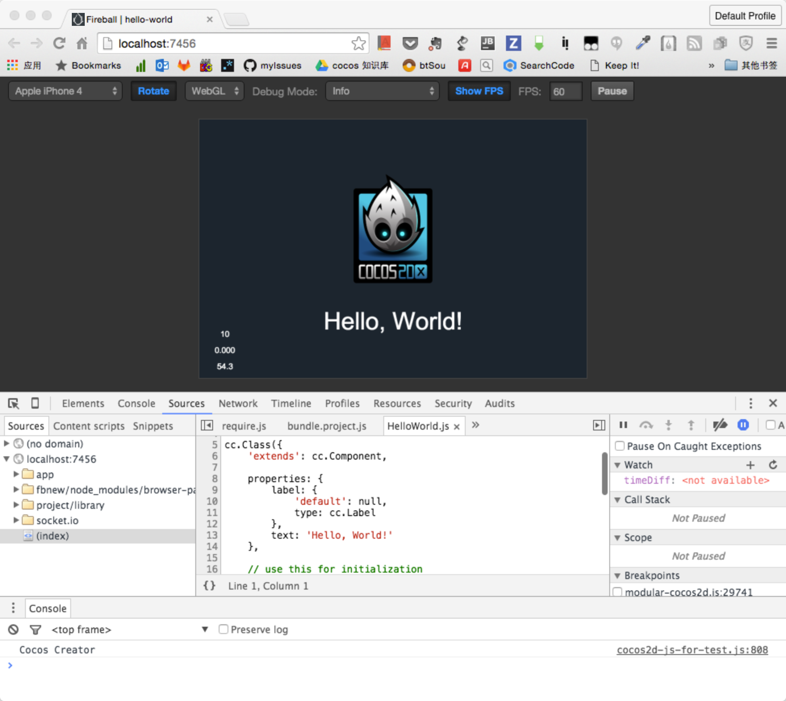

# Build and Preview

So far we have introduced main panels of the editor so you can manage assets, build scene and tweaking components. Then it's time to preview and build the game to run on your target platform.

## Select a Preview Platform

We can click the **Preview** button on top of editor window to see the game in action. On the left of **Preview** button we can choose a platform from **Simulator** and **Browser**.

**Notice** there must be a scene opened before you can see anything in preview.

### Simulator

Choose **Simulator** and click **Preview** will launch Cocos Simulator to run the current game scene.

When running simulator, scripting logs will be shown in **Console** panel.

### Browser

Choose **Browser** and click **Preview** will launch the game in your default browser. We recommend [Chrome](http://google.com/chrome) as the browser of the choice, since the DevTools of Chrome is most advanced in web debugging and inspecting.

There are a bunch of control in Preview page:

- On the left are viewport size presets to simulate how your game look on mobile devices.
- **Rotate** button to toggle between landscape and portrait view.
- The third control from the left is for switching between WebGL and Canvas rendering mode.
- **Debug Mode** let you control the severe level of logs to be shown.
- **Show FPS** toggle framerate and draw call stats display
- **FPS** framerate cap.
- **Pause** to pause game.

#### Debugging with VS Code

We can debug our projects with VS Code text editor, please read [Use VS Code to debug web games](../getting-started/coding-setup.md##use-vs-code-to-debug-web-games) for details.

#### Debugging with browser Developer Tools

Take Chrome for example, open menu and choose `More Tools/Dev Tools` to open the Developer Tools. We can inpect source code, add breakpoint, check call stack and step control during debugging.

To learn more about using DevTools, please read [Chrome Dev Tools User Guide](https://developer.chrome.com/devtools), or other browser's developer documentation.

## Build

The next step is to build your game so it can run on the target platform's device. Open the **Build** panel from main menu's `Project/Build`, you can publish your game to iOS、Android、HTML5、Windows、Mac、Cocos Play with this tool.

For detailed information of publish your game, please read [Cross-platform Game Publish](../publish/index.md).

**Notice** running your game in simulator may not be the same as running your game on real device. Please always check your game on target platform before releasing it.