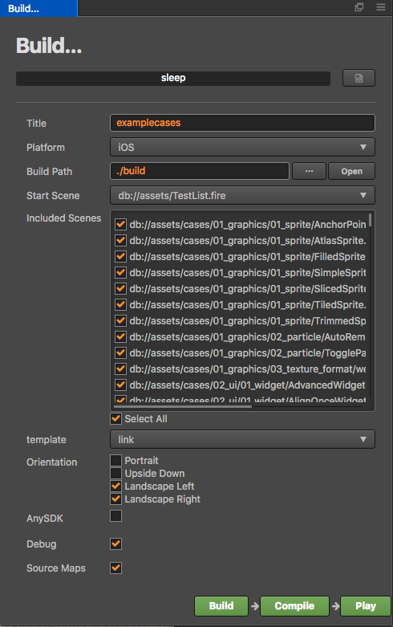

# Build and release games on Native platforms

Open `Project/Build...` in the main menu and the constructing release window.

Currently, there are five native platforms, which include: Cocos Runtime, Android, iOS, Mac and Windows. The options of release games on Mac and Windows will only appear in concerning operating systems.



## Configure a Package Name

An input field named **package name** will appear in the constructing release window after selecting an native platform, into which you can input the package name of your game (also called Package Name or Bundle ID). The package name is usually arranged in the reverse order of the product's website url, such as: `com.mycompany.myproduct`.

**Notice**:
 - Only numbers, letters and underscores can be included in the package name. Besides, the last section of package name should start with a letter, but not an underline or a number.
 - If your Xcode version is less than 7.2, the package name also can not include underscores.


## Construct an Native Project

After selecting the release platform and setting up the package name and initial scene, the project can now be constructed. Click the **construct** button on the bottom right corner, and start constructing workflow.


When compiling scripts and zipping resources, a progress bar will display on the top of the window. After the progress bar has reached 100%, please continue to wait unitl the construction of the project in **console** is finished. If it's successful, the diary as showed below will display:

```bash
Built to "/myProject/tutorial-blackjack/build/tutorial-blackjack" successfully
```

Next, you can choose to directly open the original preview provided by Cocos Creator, or manually open the constructed native project in IDE of corresponding platform for further preview, adjustment and release.

## Direct Preview

Click the **Play** button on the bottom right corner, you can preview games of native platforms via the default method provided by Cocos Framework.


On Mac/iOS/Windows platforms, Cocos Simulator will be used to preview the game on the desktop. While on Android platform, you can preview only after connecting your computer with smartphone via USB port and opening USB test on your computer.

After clicking **Play** button, a part of the constructing work will be continued, the real time progress of which will be seen on the console.

## Use an Native Project


Click the **open** button near the release path, the constructing release path will be opened in the document manager of operating system.

`jsb` of this path includes all the native constructing projects.


The red frames in the picture indicate projects of different native platforms. Next, only by using IDE(such as: Xcode,Eclipse,Visual Studio) that corresponds to the native platform to open these projects, can you make further operations like compilation, preview and release. For the usage instructions for native platform's IDE, please search related information on your own, which will not be discussed in detail here.


