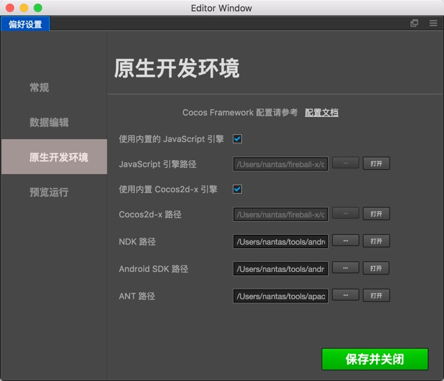

# 安装配置原生开发环境

除了内置的 Web 版游戏发布功能外，Cocos Creator 使用基于 cocos2d-x 引擎的 JSB 技术实现跨平台发布原生应用和 Cocos Play 手机页游。在使用 Cocos Creator 打包发布到原生平台之前，我们需要先配置好 cocos2d-x 相关的开发环境。

## Android 平台相关依赖

要发布到 Android 平台，需要安装以下全部开发环境依赖。

如果您没有发布到 Android 平台的计划，或您的操作系统上已经有完整的 Android 开发环境，可以跳过这个部分。

### Android SDK 10 依赖

从 v1.2.2 开始，默认的 Android 项目模板将指定 `android-10` sdk platform 版本作为默认的 target，详情可见 [Pull Request Use API Level 10](https://github.com/cocos-creator/cocos2d-x-lite/pull/316)。

如果编译 Android 工程时遇到 '未找到 android-10' 之类的报错，可以下载单独的 Android SDK platform 包 [android-10.zip](http://cocostudio.download.appget.cn/android-sdk/android-10.zip)，并解压到您的 Android SDK 根目录下的 `platforms` 目录里，和其他 `android-xx` 目录并列。

如果需要更改 target 的 API Level，可以修改原生引擎目录下 `cocos/platform/android/java/project.properties` 文件中的

```java
    target=android-10
```

将 `android-10` 修改为其他您需要的 API Level。

### 下载发布 Android 平台所需的 SDK 和 NDK

从以下链接下载和操作系统一致的 Android SDK 和 NDK：

- [Android SDK Windows](http://cocostudio.download.appget.cn/android-sdk/android-sdk-win.zip)
- [Android SDK Mac](http://cocostudio.download.appget.cn/Cocos/CocosStore/android22-sdk-macosx.zip)
- [Android NDK Windows 32位](http://cocostudio.download.appget.cn/Cocos/CocosStore/android-ndk-r10d-windows-x86.zip)
- [Android NDK Windows 64位](http://cocostudio.download.appget.cn/Cocos/CocosStore/android-ndk-r10e-Windows.zip)
- [Android NDK Mac](http://cocostudio.download.appget.cn/Cocos/CocosStore/android-ndk-r10e-macosx.zip)

下载之后解压到任意位置，我们之后需要设置 Android SDK 和 NDK 的路径，请记住以上文件的解压位置。

### 下载 ANT

[Apache Ant](http://ant.apache.org) 是一种用来构建软件的 Java 程序库和可执行文件。我们在构建 Android 平台项目时需要这个软件的支持。

之前前往 Apache Ant 的下载链接：

[Apache Ant 下载](http://ant.apache.org/bindownload.cgi)

选择稳定版的 `.zip` 压缩包并下载，下载完成后解压到任意目录，之后我们在进行设置时需要选择这个目录。

### 下载 Java SDK （JDK）

编译 Android 工程需要本地电脑上有完整的 Java SDK 工具，请到以下地址下载：

[Java SE Development Kit 8 Downloads](http://www.oracle.com/technetwork/java/javase/downloads/jdk8-downloads-2133151.html)

下载时注意选择和本机匹配的操作系统和架构，下载完成后运行安装程序即可。

**注意**：安装完成后请在命令行中确认 `java` 命令是有效的，否则请参考下文手动添加 `java` 可执行文件所在目录到您的环境变量中。

## 安装 C++ 编译环境

Cocos2d-x 自带的编译工具 Cocos Console 需要以下运行环境：

- Python 2.7.5+，[下载页](https://www.python.org/downloads/)，注意不要下载 Python 3.x 版本。
- Windows 下需要安装 Visual Studio 2013 或 2015 社区版，[下载页](https://www.visualstudio.com/downloads/download-visual-studio-vs)
- Mac 下需要安装 Xcode 和命令行工具，[下载页](https://developer.apple.com/xcode/download/)

## 配置原生发布环境路径

下载安装好开发环境依赖后，让我们回到 Cocos Creator 中配置构建发布原生平台的环境路径。在主菜单中选择 `文件/偏好设置`，打开偏好设置窗口：



我们在这里需要配置以下三个路径：

- **NDK**，选择刚才下载并解压后的 NDK 路径，不需要编译 Android 平台的话这里可以跳过
- **Android SDK**，选择刚才下载并解压后的 Android SDK 路径，不需要编译 Android 平台的话这里可以跳过
- **ANT**，请选择前面下载并解压完成的 Apache Ant 路径，选定的路径中应该包括一个名叫 `ant` 的可执行文件。

配置完成后点击 **保存** 按钮，保存并关闭窗口。

**注意**：这里的配置会在编译 **原生工程** 的时候生效。如果没有生效（一些 Mac 机器有可能出现这个情况），可能需要您尝试到 **系统环境变量** 设置这些值：COCOS_CONSOLE_ROOT, ANT_ROOT, NDK_ROOT, ANDROID_SDK_ROOT。

## 注意事项

由于在公测版中收到了很多原生打包的问题反馈，这里补充一些可能的问题原因。

1. 检查路径

    在偏好设置中设置好的路径必须确保是正确的，比如：ant 路径需要设置到 ant 安装目录内的 bin 目录下，NDK 是其根目录，而 Android SDK 的目录下应该包含 build-tools、platforms 等文件夹。

2. 检查 Xcode 和 Visual Studio

    打包 Mac 版本和 iOS 版本需要 Xcode 支持。打包 Windows 版本需要安装 Visual Studio，同时在安装 Visual Studio 时，默认并没有勾选 C++ 编译组件。如果没有安装，则需要重新安装并选择 C++ 相关编译组件。

3. 检查 NDK 版本

    请使用 NDK r10c 以上的版本，推荐 r10e。

4. Windows 平台需要检查 JAVA_HOME 环境变量

    如果使用 Windows 平台，请确认你的环境变量中包含 JAVA_HOME，可以通过右键点击我的电脑，选择属性，打开高级选项卡中来查看和修改环境变量。Windows 平台可能需要重启电脑才会生效。

    参考[如何设置或更改 JAVA 系统环境变量？](https://www.java.com/zh_CN/download/help/path.xml)

5. 检查 JAVA 环境

    在 Mac 终端或者 Windows 命令行工具中输入下面代码来查看：

    ```
    java -version
    ```

    如果显示为 JAVA SE 则没有问题，如果系统中使用的是 JRE，则需要安装 [JAVA SE 运行环境](http://www.oracle.com/technetwork/java/javase/downloads/index.html)。

6. 包名问题

    检查构建发布面板中的包名，包含空格，`-`等都是非法的包名。

7. Android 6.0 SDK 的支持问题

    Android 6.0 SDK 去除了 Cocos2d-x 依赖的 HttpClient 库，所以会导致编译失败。目前的解决方案是：

    - 找到 Android SDK 目录下的 HttpClient 库：`platforms/android-23/optional/org.apache.http.legacy.jar`。
    - 如果使用源码引擎模版，需要拷贝到原生编译目录下的 `jsb/frameworks/cocos2d-x/cocos/platform/android/java/libs/` 目录下。如果使用预编译库引擎模版，需要拷贝到原生编译目录下的 `jsb/frameworks/runtime-src/proj.android/jars/` 目录下。
    - 重新编译。

8. Android 编译成功，但运行时提示 `dlopen failed: cannot locate symbol "xxxx" referenced by "libcocos2djs.so"...`

    请检查 NDK 和 Android SDK 的架构和版本是否和测试用的 Android 系统相对应，另外可以尝试使用本文章下载的 NDK 和 Android SDK 来测试。

最后，如果依然打包失败，可以尝试创建一个标准的 Cocos2d-x 工程，并尝试编译，如果 Cocos2d-x 工程可以编译，而 Cocos Creator 无法打包，请将 bug 通过[论坛](http://www.cocoachina.com/bbs/thread.php?fid-71.html)反馈给我们。

---

现在您已经完成了全部原生开发环境的配置，接下来请继续前往 [打包发布原生平台](publish-native.md) 说明文档。


